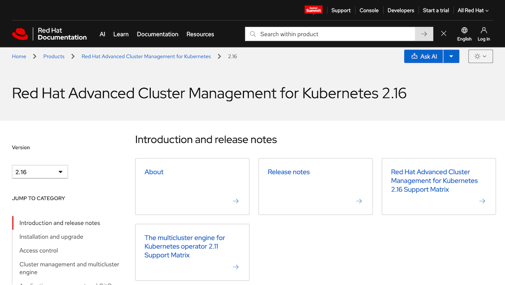
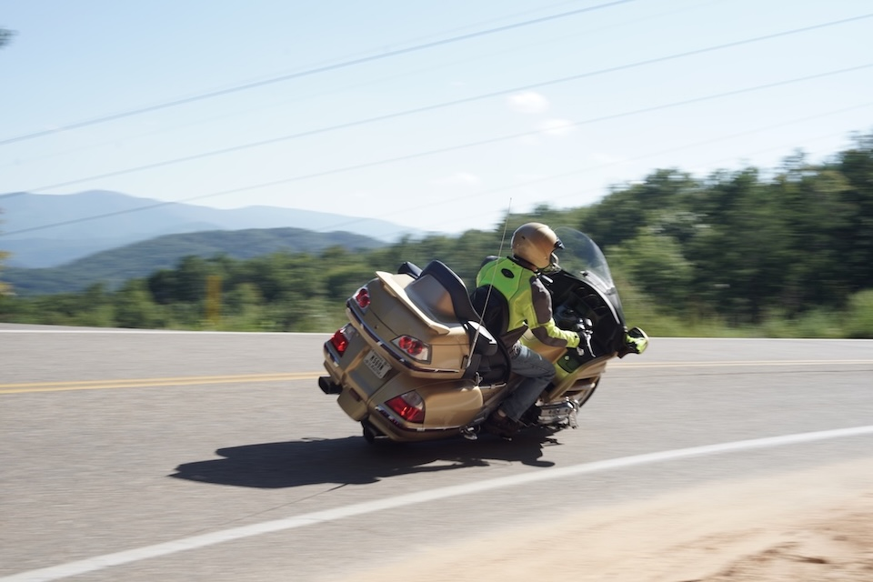
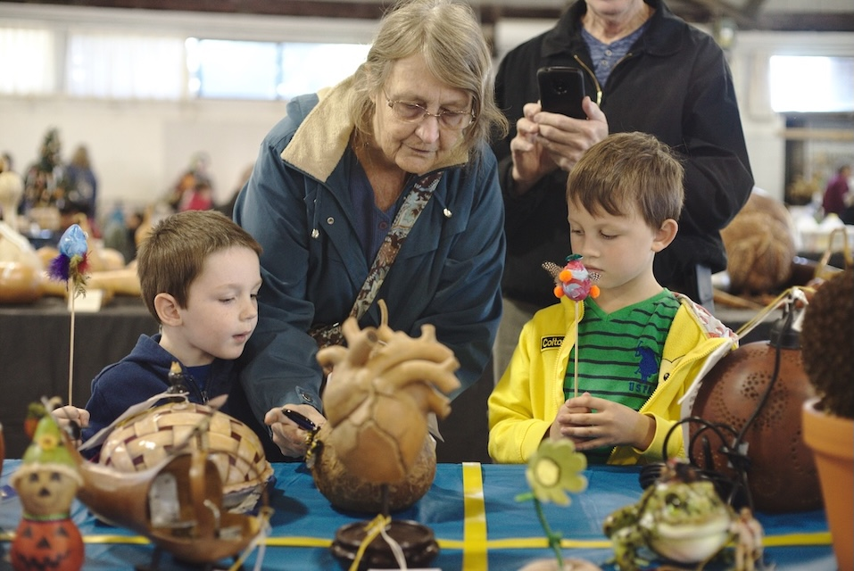
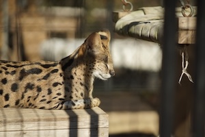

# Projects

## Documentation

    

        
    

    

        <h3 class="publication-title">
            <a href="https://github.com/stolostron/rhacm-docs" class="publication-link">
                Red Hat Advanced Cluster Management for Kubernetes documentation 
            </a>
        </h3>
        
Open source code for the Red Hat Advanced Cluster Management for Kubernetes documentation.

        
Various authors

        
2022 - 2026

        

            Open source documentation
            <a href="https://github.com/" class="tag tag-publisher">GitHub</a>
            <a href="https://github.com/stolostron/rhacm-docs/pull/8616" class="tag tag-extra">PR sample 1</a>
            <a href="https://github.com/stolostron/rhacm-docs/pull/8396" class="tag tag-extra">PR sample 2</a>
            <a href="https://github.com/stolostron/rhacm-docs/pull/7925" class="tag tag-extra">PR sample 3</a>
        

    

## Journalism

    

        
    

    

        <h3 class="publication-title">
            <a href="https://projects.elonnewsnetwork.com/dragon/" class="publication-link">
                Tail of the Dragon attracts thrill-seekers, motoring enthusiasts
            </a>
        </h3>
        
FORNEYS GAP, NC - Deep in the Appalachian Mountains dwells a beast known as Tail of the Dragon. It might be named after a mythical creature, but the 318 curves packed into this 11-mile stretch of mountain road present an all too real challenge.

        
Oliver Fischer

        
Oct. 8, 2019

        

            In-depth feature story
            <a href="https://www.elonnewsnetwork.com/" class="tag tag-publisher">Elon News Network</a>
        

    

    

        
    

    

        <h3 class="publication-title">
            <a href="https://student.elon.edu/ofischer/gourd/" class="publication-link">
                Dying form of gourd art reveals underlying generational trend
            </a>
        </h3>
        
RALEIGH - Stan Atwood grew up in the mountains where running water wasn’t always available. The first time he became acquainted with gourds was when his grandmother would use them to get water from the spring.

        
Oliver Fischer

        
Dec. 12, 2019

        

            In-depth feature story
            <a href="https://student.elon.edu/ofischer/" class="tag tag-publisher">ePortfolio</a>
        

    

    

        
    

    

        <h3 class="publication-title">
            <a href="https://www.elon.edu/u/news/2019/09/19/author-alex-wagner-shares-her-journey-to-discover-her-identity-and-family-history/" class="publication-link">
                Author Alex Wagner shares her journey to discover her identity and family history
            </a>
        </h3>
        
A journalist and author of "Futureface," this year's Common Reading selection, Wagner talked about surprises and findings on her journey to discover her identity and family history as she engaged in a forum for the common reading on Sept. 18 in Alumni Gym.

        
Oliver Fischer

        
Sept. 19, 2019

        

            Event coverage
            <a href="https://www.elon.edu/u/news/" class="tag tag-publisher">Today at Elon</a>
        

    

        
    

    

        <h3 class="publication-title">
            <a href="https://web.archive.org/web/20191215062649/https://www.thetimesnews.com/entertainmentlife/20190721/piedmont-farm-animal-refuge-cares-for-abusedneglected-animals/" class="publication-link">
                Piedmont Farm Animal Refuge cares for abused, neglected animals
            </a>
        </h3>
        
PITTSBORO — What do farm animals and veganism have in common? Lenore Braford, it seems. The founder and shelter manager of Piedmont Farm Animal Refuge turned vegan 12 years ago. That didn’t just bring about a dietary change, but an occupational one, too.

        
Oliver Fischer

        
Jul. 21, 2019

        

            Feature story
            <a href="https://www.thetimesnews.com/" class="tag tag-publisher">Times-News Burlington</a>
        

    

        
    

    

        <h3 class="publication-title">
            <a href="https://oliverfischer4.wordpress.com/2018/12/05/conservators-center-brings-big-cats-to-burlington/" class="publication-link">
                Conservators Center brings big cats to Burlington
            </a>
        </h3>
        
Burlington is not known for its exotic wildlife, but travelers who venture out to Caswell County may be in for a surprise.

        
Oliver Fischer

        
Dec. 5, 2018

        

            Feature story
            <a href="https://oliverfischer4.wordpress.com/" class="tag tag-publisher">ePortfolio</a>
            Deprecated
        

    

## Guides

        
    

    

        <h3 class="publication-title">
            <a href="https://www.zhpmafia.com/forums/showthread.php?23374-BUDGET-PERFORMANCE-SUSPENSION-GUIDE-(Ultimate-E46-OEM-SACHS-Setup)" class="publication-link">
                Budget Performance Suspension Guide (Ultimate E46 OEM+ Sachs Setup) 
            </a>
        </h3>
        
This guide will walk you through my suggestions for refreshing your E46 suspension using OE BMW parts only. The goal is to achieve increased performance over the original ZHP setup at a lower cost than aftermarket. While written with the ZHP in mind, this guide can be applied to all non-M 6 cylinder E46s.

        
Oliver Fischer

        
Oct. 29, 2020

        

            How-to guide
            <a href="https://www.zhpmafia.com/forums/forum.php" class="tag tag-publisher">ZHP Mafia</a>
            130k views
        

    

